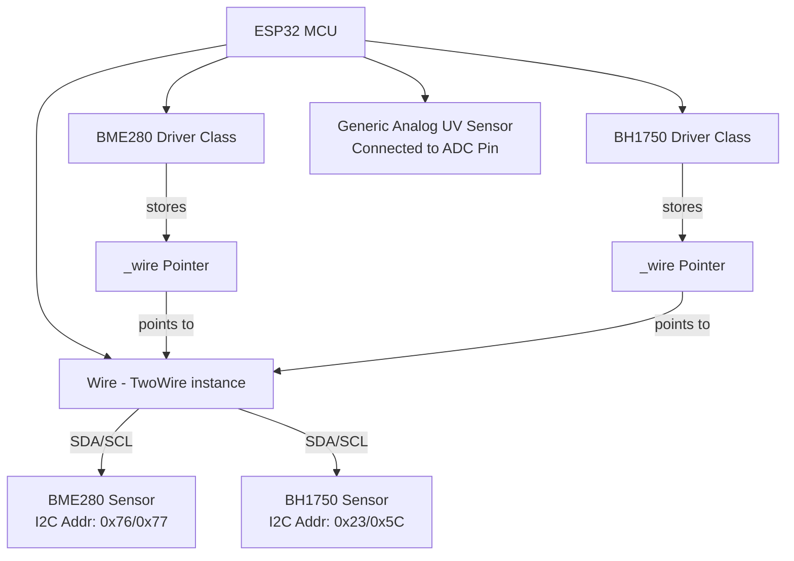

```mermaid
graph TD

%% ESP32 and Wire Bus
ESP32[ESP32 MCU]
ESP32 --> Wire[Wire - TwoWire instance]

%% BME280 driver class
ESP32 --> BME280Driver[BME280 Driver Class]
BME280Driver -- stores --> BME280_wire[_wire Pointer]
BME280_wire -- points to --> Wire

%% BH1750 driver class
ESP32 --> BH1750Driver[BH1750 Driver Class]
BH1750Driver -- stores --> BH1750_wire[_wire Pointer]
BH1750_wire -- points to --> Wire

%% Sensors connected to I2C bus
Wire -- SDA/SCL --> BME280[BME280 Sensor\nI2C Addr: 0x76/0x77]
Wire -- SDA/SCL --> BH1750[BH1750 Sensor\nI2C Addr: 0x23/0x5C]

%% Analog UV sensor
ESP32 --> UVSensor[Generic Analog UV Sensor\nConnected to ADC Pin]

```